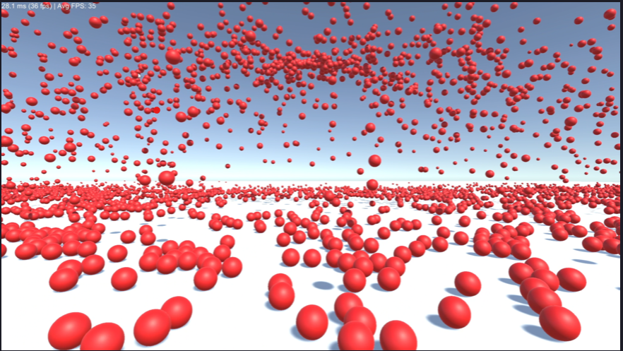

# Gabe's Object Pooling Tutorial

Object pooling is a form of optimization backed around the idea of reduce, reuse and RECYCLE.

Object pooling comes in two different forms, managed and unmanaged pools.

A __managed object pool__, is typically done with a queue, where it's impossible for errors to happen, but you may see "pop out"

An __unmanaged object pool__ is typically done with an array, where it's expected objects are returned or new objects will be created. Unmanaged can be more flexible and faster, but often requires a lot more attention and focus.

This project will be using an Unmanaged pool. Additionally, we'll be doing batching to take advantage of REUSE to save CPU time.

__Another reason you should consider pooling, is it works very well with singletons, furthering the idea of re-usability.__ 
# Results

### Naive unoptimized solution:
~ 35 FPS

### Optimized Solution, pooled and batched
~ 51 FPS

45% increase in frames!